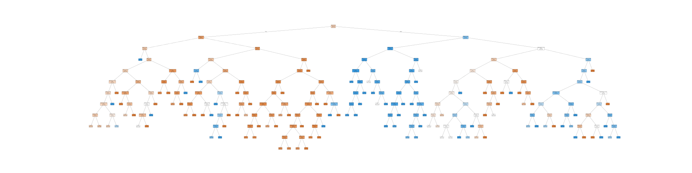

# MiniProject #00

by Patrick Donnelly & Burke Havranek

EECE 5644: Introduction to Machine Learning and Pattern Recognition

Northeastern University College of Engineering

Summer 2026, Session B

## Introduction

The purpose of this assignment is to build a decision tree categorical model using the given `titanic.csv` data, representing information on individuals involved n the Titanic disaster. In particular, given the aforementioned information, we aim to construct such a model capable of predicting whether an individual indeed survived the aforementioned disaster.

## Installation

This document and associated codebase exists in the form of a Jupyter Notebook with various auxiliary files. No external builds should be required, though Python 3.12 or newer is recommended for guaranteed compatibility. A full list of dependencies is provided in `requirements.txt`, though all such dependencies are installed automatically by the aforementioned notebook. It is recommended to run this notebook in a Python 3.12 virtual environment, though this should not be required for functionality.

## Downloading the Dataset

The dataset in question is provided in `titanic.csv`, which is publicly available on Kaggle: https://www.kaggle.com/datasets/yasserh/titanic-dataset. This data is unsanitized, requiring preprocessing within the aforementioned notebook, which in turn produces `titanic_sanitized.csv`. A copy of both data sets is provided in this repository.

## Running the Notebook

The aforementioned notebook exists in notebook.ipynb, and has been engineered to run "out of the box" without additional configuration. Running the notebook from the repository directory should be sufficient.

## Summary of Findings

After pruning some extraneous data (see `cleaning_log.md`) and training a decision tree model, we were able to produce a decision tree capable of predicting whether a given passenger would survive the Titanic disaster with 86% accuracy, per the aforementioned data, using their `Pclass`, `Sex`, `Age`, `SibSp`, `Parch`, and `Embarked` features. A copy of this tree is provided in `tree.svg`, as well as below:

